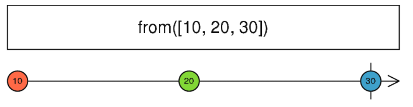

# rxjs Doc
rxjs 文档

## Observable

### Observable特性

Observable是惰性的,可以同步或者异步返回零个或者多个值的对象
* 惰性的:   被动的,只有被observer订阅才会执行 
* 多值的:   在observable中包含的subscribe回调函数中,可以发送多个值
```js
observer.next(1);
observer.next(2);
observer.next(3);
```
* 同步或者异步

```js
//**同步的**
//在observable中的回调函数中,如果方法observer.next()都是同步执行的,返回值也是同步的
var ob = new Observable(observer=>{  
  observer.next(1);  
  observer.next(2),  
  observer.next(3)
})
console.log('before');
ob.subscribe(x =>console.log(x));
console.log('after');
//before
//1
//2
//3
//after
```

```js
//**异步的**
//在observable中的回调函数中,如果方法observer.next()是异步执行的,返回值也是异步的

var ob = new Observable(observer => { 
  observer.next(1);  
  observer.next(2),  
  setTimeout(() =>  
	observer.next(3),   
	2000)})
console.log('before');
ob.subscribe(x => console.log(x));
console.log('after');
//before
//1
//2
//after
//3
```
### 创建Observable
* 使用new Observable创建,接受一个参数:subscribe函数
```js
var ob = new Observable(observer => {  
  observer.next(1);  
  observer.next(2),  
  setTimeout(() =>    
    observer.next(3),    
    2000)
})
```

* 使用创建操作符
  * of
  * from
  * interval
  * timer
  * range
  * ...


### 订阅Observable
使用.subscribe订阅observable
```js
observable.subscribe(x => console.log(x));
```
subscribe订阅方法和new Observable()中的subscribe回调方法是相同的,这表明subscribe调用在Observable的多个observer之间是独立的.

所以 **Observable无法把返回值多播给多个Observer**

### 执行Observable

在Observable被Observer订阅了以后,Observable对象中subscribe回调函数中的代码才会被执行(惰性)
Observable 执行可以传递三种类型的值：

* "Next" 通知： 发送一个值，比如数字、字符串、对象，等等。
* "Error" 通知： 发送一个 JavaScript 错误 或 异常。
* "Complete" 通知： 不再发送任何值。

可以用try/catch包裹代码,当出现错误是,可以发送error通知
```js
var ob = new Observable(observer => {  
  try {    
    observer.next(1);    
    observer.next(2);   
    observer.next(3);    
    observer.complete();  } 
  catch (err) {    
    observer.error(err); // 如果捕获到异常会发送一个错误  
  }
})
```

### 清理Observable

当我们调用`observable.subscribe`并且Observer在接受完值以后希望终止Observable执行,以避免浪费资源,可以调用`unsubscribe()` 取消执行
```js
var observable = from([10, 20, 30]); 
var subscription = observable.subscribe(x => console.log(x)); 
// 稍后： subscription.unsubscribe();
```

当我们自己创建Observable试,需要定义unsubscribe函数来实现清理工作

```js
var observable = new Observable(observer=> { 
  // 追踪 interval 资源 
  var intervalID = setInterval(() => { observer.next('hi'); }, 1000); 
  // 提供取消和清理 interval 资源的方法
  return function unsubscribe() { 
    clearInterval(intervalID); }; 
});
```

## Observer
Observer是Observable发出的值的消费者,  他作为Observable.subscribe()方法参数的一组回调函数集合
包含三种回调函数next,error,complete
```js
var observer = {
  	next: x => console.log('Observer got a next value: ' + x), 
	error: err => console.error('Observer got an error: ' + err), 
  	complete: () => console.log('Observer got a complete notification'), 
};
```

并且传给`Observable.subscribe()`方法

```js
observable.subscribe(observer);
```
当订阅 Observable 时，你可能只提供了一个回调函数作为参数，而并没有将其附加到观察者对象上，例如这样：
```js
observable.subscribe(x => console.log('Observer got a next value: '+ x));
```

在 observable.subscribe 内部，它会创建一个观察者对象并使用第一个回调函数参数作为 next 的处理方法。三种类型的回调函数都可以直接作为参数来提供：

```js
observable.subscribe(   
  	x => console.log('Observer got a next value: '+ x),   
  	err => console.error('Observer got an error: '+ err),
  	()=> console.log('Observer got a complete notification')
);
```

## Subscription
Subscription 是表示可清理资源的对象，通常是 Observable 的执行observable.subscribe(...)

> Subscription 基本上只有一个 unsubscribe() 函数，这个函数用来释放资源或去取消 Observable 执行。

subscription可以合并在一起,调用一次unsubscribe()方法,多个Subscription都会取消订阅.

```js

var ob1$ = interval(1000);
var ob2$ = interval(2000);
var subscr1$ = ob1$.subscribe(x => console.log('ob1:' + x));
var subscr2$ = ob2$.subscribe(x => console.log('ob2:' + x));
subscr1$.add(subscr2$);
setTimeout(() => subscr1$.unsubscribe(), 5000);
//ob1:0
//ob2:0
//ob1:1
//ob1:2
//ob2:1
//ob1:3
```
subscriptions 还有一个 remove(otherSubscription)方法，用来撤销一个已添加的子 Subscription

## Subject
Subject 是一种特殊类型的 Observable，它允许将值多播给多个观察者，所以 Subject 是多播的，而普通的 Observables 是单播的(每个已订阅的观察者都拥有 Observable 的独立执行)

> Subject 像是 Observable，但是可以多播给多个观察者。Subject 还像是 EventEmitters，维护着多个监听器的注册表。

**每个 Subject 都是 Observable**

定义Subject对象不需要传入subscribe回调函数,因为在Subject内部,不会调用发送值的执行.只有等到有Observer订阅Subject以后(Subject会把Observer添加到观察值列表)

**每个 Subject 都是观察者**

Subject 是一个有如下方法的对象： next(v)、error(e)和 complete()
需要调用Subject.next(...)方法,它会将值多播给已注册监听该 Subject 的观察者们。

```js
//定义Subject对象不需要传入subscribe回调函数
var subject = new Subject();;
//只有等到有Observer订阅Subject以后,Subject会把Observer添加到观察值列表
subject.subscribe(x => console.log('observer a: ' + x));
subject.subscribe(x => console.log('observer b: ' + x));
//再调用Subject.next(...)方法,它会将值多播给已注册监听该 Subject 的观察者们。
subject.next('hello');subject.next('world');
```

因为 Subject 是观察者，这也就在意味着你可以把 Subject 作为参数传给任何 Observable 的 subscribe 方法

```js
var subject = new Subject();
subject.subscribe(x => console.log('observer a: ' + x));
subject.subscribe(x => console.log('observer b: ' + x));
var ob = from([1, 2, 3]);
ob.subscribe(subject);
```
逻辑如下:
1. ob这个Observable把值发送给了subject这个Observer,
2. subject作为Observable又把值发送给了订阅他的两个Observer
3. 这两个Observer执行内部next回调函数,也就是console.log方法

## BehaviorSubject
它保存了发送给消费者的最新值。并且当有新的观察者订阅时，会立即从 BehaviorSubject 那接收到“当前值”
> BehaviorSubjects 适合用来表示“随时间推移的值”。举例来说，生日的流是一个 Subject，但年龄的流应该是一个 BehaviorSubject 。

```js

var subject = new BehaviorSubject(0); // 0是初始值
subject.subscribe(x => console.log('observerA: ' + x));
subject.next(1);
subject.next(2);
//在subject发出2以后,又有一个新的Observer
subject.subscribe(x => console.log('observerB: ' + x));//第二个观察者订阅时会得到值2
subject.next(3);
//observerA: 0
//observerA: 1
//observerA: 2
//observerB: 2
//observerA: 3
//observerB: 3
```

## ReplaySubject

ReplaySubject可以发送旧值给新的订阅者，但它还可以记录 Observable 执行的一部分。

> ReplaySubject 记录 Observable 执行中的多个值并将其回放给新的订阅者

### 指定回放个数
当创建 ReplaySubject时，你可以指定回放多少个值：
```js
var subject = new ReplaySubject(3); // 为新的订阅者缓冲3
subject.subscribe(x => console.log('observerA: ' + x));
subject.next(1);subject.next(2);
subject.next(3);
subject.next(4);
console.log('observerB will subscribe soon');
subject.subscribe(x => console.log('observerB: ' + x));
subject.next(5);
//**output**
//observerA: 1
//observerA: 2
//observerA: 3
//observerA: 4
//observerB will subscribe
//observerB: 2
//observerB: 3
//observerB: 4
//observerA: 5
//observerB: 5
```
### 指定回访时长
你还可以指定 window time(以毫秒为单位)来确定多久之前的值可以记录。在下面的示例中，我们使用了较大的缓存数量100，但 window time 参数只设置了500毫秒。
```js

var subject =new ReplaySubject(100,500/* windowTime */); 
subject.subscribe(x =>console.log('observerA: '+ x));
var i =1; 
setInterval(()=> subject.next(i++),200); 
setTimeout(()=>subject.subscribe(x =>console.log('observerB: '+ x))  
   ,1000);
```

从下面的输出可以看出，第二个观察者得到的值是3、4、5，这三个值是订阅发生前的500毫秒内发生的：
```js
observerA:1 
observerA:2 
observerA:3 
observerA:4 
observerA:5 
observerB:3 
observerB:4 
observerB:5 
observerA:6 
observerB:6
  ...
```

## AsyncSubject
只有当 Observable 执行完成时(执行 complete())，它才会将执行的最后一个值发出
```js
var subject = new AsyncSubject();
subject.subscribe(x => console.log('observerA: ' + x));
subject.next(1);
subject.next(2);
subject.next(3);
subject.next(4);
subject.subscribe(x => console.log('observerB: ' + x));
subject.next(5);
subject.complete();
```
输出：
```js
observerA:5
observerB:5
```
AsyncSubject 和 last()操作符类似，因为它也是等待 complete 通知，以发送一个单个值。

## Operator
### Create Operator

#### from

把数组对象转为Observable,数组每一个item值分别发送



```js
const from$ = from(['a', 'b', 'c']).subscribe(x => console.log(x));
//a
//b
//c
```
#### fromEvent
把Event转为Observable


```js
const btn = document.getElementById('btn');
const btn$ = fromEvent(btn, 'click');
btn$.subscribe(x => console.log(x));
```

#### of
把输入参数转为Observable


```js
var ob$ = of('a'); 
ob$.subscribe(x => console.log(x));
```

当给of传入数组是,of会把数组当作一个值发出,**跟from有区别**

```js
const of$ = of(['a', 'b', 'c']).subscribe(x => console.log(x))
//["a","b","c"]
```
#### interval

在指定的时间间隔发出连续的数字


```js
import { interval } from 'rxjs';
import { take } from 'rxjs/operators';

const numbers = interval(1000);
const takeFourNumbers = numbers.pipe(take(4));
takeFourNumbers.subscribe(x => console.log('Next: ', x));
// Logs:
// Next: 0
// Next: 1
// Next: 2
// Next: 3
```

#### range

在指定的数字范围内发出连续的数字


```js
const rang$ = range(2, 5).subscribe(x => console.log(x))
```
#### timer

在初始延时（initialDelay）之后开始发送并且在每个时间周期（ period）后发出自增的数字。

> 就像是interval, 但是你可以指定什么时候开始发送。


```js
const timer$ = timer(2000, 5000).subscribe(x => console.log(x))
```

### Transform Operator

#### map

可以对Observable发出的每个值进行转换处理并且发出值


```js
from([1, 2, 3]).pipe(  
  map(x => 'value= ' + x)
).subscribe(x => console.log(x))
```
#### mapTo

类似于 map，但它每一次都把源值映射成同一个常量输出值

```js
const mapTo$ = from(['a', 'b', 'c']).pipe(
  mapTo('Hi')
).subscribe(x => console.log(x));
//3* Hi
```

#### pluck

可以获取Observable对象的某一个属性,并发出值

> 类似于 map，但仅用于选择每个发出对象的某个嵌套属性。


```js
from( [
	{ name: 'aa', age: 1 },   
	{ name: 'bb', age: 2 },   
	{ name: 'cc', age: 3 }  
).pipe(    
  pluck('name')  
).subscribe(x => console.log('name is ' + x))
//name is aa
//name is bb
//name is cc
```

#### groupBy

根据指定条件将源 Observable 发出的值进行分组，并将这些分组作为 GroupedObservables发出，每一个分组都是一个 GroupedObservable。


```js
of({ id: 1, name: 'JavaScript' },
  { id: 2, name: 'Parcel' },
  { id: 2, name: 'webpack' },
  { id: 1, name: 'TypeScript' },
  { id: 3, name: 'TSLint' }).pipe(
    groupBy(x => x.id),
    mergeMap(x => x.pipe(
      reduce((acc, cur) => [...acc, cur], [])
    )),
  ).subscribe(x => console.log(x));
// 显示：
// [	 { id: 1, name: 'aze1' }, 
//	 	{ id: 1, name: 'erg1' },
// 		{ id: 1, name: 'df1' } 	]
// 
// [ 	{ id: 2, name: 'sf2' }, 
// 	{ id: 2, name: 'dg2' }, 
// 	{ id: 2, name: 'sfqfb2' },
//	 { id: 2, name: 'qsgqsfg2' }	 ] 
// 
// [ { id: 3, name: 'qfs3' } ]
```
groupBy通过keySelector函数可以计算出分组后的key.
在使用mergeMap时,每次发出的GroupedObservable都会查看所属key值是否存在,
若key值存在,则内部Observable值发送到相同的key中
若不存在,则先创建key,并把内部observable值发送到这个key中

```js
of(
  { id: 1, name: 'JavaScript' },
  { id: 2, name: 'Parcel' },
  { id: 2, name: 'webpack' },
  { id: 1, name: 'TypeScript' },
  { id: 3, name: 'TSLint' }
).pipe(
  groupBy(p => p.id, p => p.name),
  mergeMap(group$ =>
    //内部observable的reduce操作是基于相同key值的,所以最后打印的是三组值
    group$.pipe(reduce((acc, cur) => [...acc, cur], [`${group$.key}`]))
  ),
).subscribe(p => console.log(p));
// ["1", "JavaScript", "TypeScript"]
// ["2", "Parcel", "webpack"]
// ["3", "TSLint"]
```

#### switchMap

将每个源值投射成 Observable，该 Observable 会合并到输出 Observable 中， 并且只发出最新投射的 Observable 中的值。

> 当发出一个新的内部 Observable 时，switchMap 会停止发出先前发出的内部 Observable 并开始发出新的内部 Observable 的值。后续的内部 Observables 也是如此。


```js
const swtichMap$ = of(1, 2, 3).pipe(
  tap(x => console.log('observable value: ' + x)),
  switchMap(x => interval(1000))
).subscribe(x => console.log(x));
//当发出最后一个值:3 时,前两个值得内部observable得值就停止发射了
//observable value: 1
//observable value: 2
//observable value: 3
//0
//1
//2
//..
```

#### mergeMap

将每个源值投射成 Observable ，该 Observable 会合并到输出 Observable 中。

> 将每个值映射成 Observable ，然后使用 mergeAll 打平所有的内部 Observables 。

**mergeMap = map + mergeAll**

用mergeMap实现mergeAll例子中的输出


```js
const letters$ = of('a', 'b', 'c');
const high$ = letters$.pipe(
  mergeMap(x => interval(1000).pipe(
    map(i => x + i)
  ))
).subscribe(x => console.log(x));
```

用mergeAll需要定义高阶observable和一介observable

```js
const letters$ = of('a', 'b', 'c');
const high$ = letters$.pipe(
  map(x => interval(1000).pipe(
    map(i => x + i)
  )));
const first$ = high$.pipe(
  mergeAll()
).subscribe(x => console.log(x));
```

#### concatMap

将源值投射为一个合并到输出 Observable 的 Observable,以串行的方式等待前一个完成再合并下一个 Observable。

> 将每个值映射为 Observable, 然后使用concatAll将所有的 内部 Observables 打平。

**concatMap = map +concatAll**


```js
const concatMap$ = fromEvent(document, 'click').pipe(
  concatMap(x => interval(1000).pipe(
    take(4))
  )
).subscribe(x => console.log(x));
//连续click 3次, observable会串行执行内部observeble并发出值
//先发出第一次click内部值
//0,1,2,3
//再发出第二次click内部值
//0,1,2,3
//最后发出最后一次click的内部值
//0,1,2,3
```
### Filter Operator

#### take

只发出源 Observable 最初发出的的N个值 (N = count),然后它便完成(执行complete回调)，无论源 Observable 是否完成


```js
var ob$ = new Observable(observer => {  
 	observer.next(1),  
    observer.next(2),  
    observer.next(3),  
    observer.next(4),  
    observer.next(5)
}).pipe(take(2));
ob$.subscribe({  
  next: x => console.log(x),  
  complete: () => console.log('complete')
})
//1
//2
//complete
```

#### takeUntil

它发出源 Observable 的值，然后直到第二个 Observable (即 notifier )发出值或者complete，它便完成


```js
interval(1000).pipe(
  takeUntil(fromEvent(document, 'click'))
).subscribe(x => console.log(x));
//0
//1
//2
//当发生click事件, 源interval Observable会被停止,并完成
//complete
```

#### debounceTime

只有在特定的一段时间经过后并且没有发出另一个源值发出，才从源 Observable 中发出一个值。

> 就像是delay, 但是只通过每次大量发送中的最新值。


```js
//500毫秒内没有新的按键,Observable会把当前input中的值发出
const input = document.getElementById('input');
const input$ = fromEvent(input, 'keyup').pipe(  
  debounceTime(500)
).subscribe(x => console.log(x.target.value))
```

#### debounce

只有在另一个Observable发出值(不是complete),并且当前Observable没有发出另一个原值后,才从源 Observable 中发出一个值。

> 就像是 debounceTime, 但是静默时间段由第二个 Observable 决定。


```js
const input = document.getElementById('input');
const ob$ = new Observable(observer => {
  //只要有值发出,不用等到complete函数执行
  observer.next(1),  
    setTimeout(() => {    
    	observer.next(2),   
    	observer.complete() 
  	}, 3000)})
const input$ = fromEvent(input, 'keyup').pipe(  
  //只有当ob$发出值并且当前 input$没有新的按键操作时,
  //input$才会发出值
  debounce(() => ob$)
).subscribe(x => console.log(x.target.value))
```

#### distinct

返回 Observable，它发出由源 Observable 所发出的所有与之前的项都不相同的项。

* 对于简单类型的Observable对象,不需要提供 keySelector 函数

```js
const arr$ = of('a', 'b', 'c', 'a', 'd', 'b').pipe(  
  distinct()
).subscribe(x => console.log(x))
//a
//b
//c
//d
```

* 对于对象类型的Observable对象,需要传入keySelector 函数,用来选择某个键的值以检查是否是不同的

```js
const arr$ = of( 
  { age: 4, name: 'Foo' },  
  { age: 7, name: 'Bar' },  
  { age: 5, name: 'Foo' }).pipe(   
  distinct(x => x.name) 
).subscribe(x => console.log(x))
//{ age: 4, name: 'Foo' }
//{ age: 7, name: 'Bar' }
```

#### distinctUntilChanged

distinctUntilChanged返回 Observable，它发出源 Observable 发出的所有与前一项不相同的项。如果提供了 compare 函数，那么每一项都会调用它来检验是否应该发出这个值。
如果没有提供 compare 函数，默认使用相等检查。

* 源Observable为数值

```js
of(1, 1, 2, 2, 2, 1, 1, 2, 3, 3, 4).pipe(
  distinctUntilChanged()
).subscribe(x => console.log(x));
// 1, 2, 1, 2, 3, 4
```

* 使用compare函数

```js
interface Person { 
  age: number, 
  name: string 
} 
of<Person>( { age: 4, name: 'Foo'}, { age: 7, name: 'Bar'}, { age: 5, name: 'Foo'},{ age: 6, name: 'Foo'}
).pipe(
  	distinctUntilChanged((p: Person, q: Person) => 
    	p.name === q.name)
	).subscribe(x => console.log(x)); 
// 显示： 
// { age: 4, name: 'Foo' } // { age: 7, name: 'Bar' } // { age: 5, name: 'Foo' }
```

#### filter

只发送源Observable中满足predicate函   数的item来进行过滤


```js
const clicks = fromEvent(document, 'click'); 
const clicksOnDivs = clicks.pipe(filter(ev => ev.target.tagName === 'DIV')); 
clicksOnDivs.subscribe(x => console.log(x));
```

#### first

只发出由源Observable所发出的值中第一个(或第一个满足条件的值),发出值后subscribe结束


```js
const click$ = fromEvent(document, 'click').pipe(  
  first()).subscribe({    
  next: x => console.log(x),    
  complete: () => console.log('subscription complete')  
});
//MouseEvent {isTrusted: true, screenX: 2580, screenY: 181, clientX: 20, clientY: 78, …}
//subscription complete
```

也可以像filter一样加入predicate,这事只发出第一个满足条件的值

```js
const clicksOnDivs = clicks.pipe(  
  first(ev => ev.target.tagName === 'DIV')  
); 
clicksOnDivs.subscribe(x => console.log(x));
```

#### last

与first相反


```js
const click$ = of(1, 2, 3, 4).pipe(  
  last()).subscribe({    
  next: x => console.log(x),    
  complete: () => console.log('subscription complete') 
});
//4
//subscription complete
```

#### skip

返回一个 Observable， 该 Observable 跳过源 Observable 发出的前N个值(N = count)。


```js
const click$ = of(1, 2, 3, 4).pipe( 
  skip(2)).subscribe({  
  next: x => console.log(x),   
  complete: () => console.log('subscription complete') 
});
//3
//4
//subscription complete
```

#### skipLast

该 Observable 累积足够长的队列以存储最初的N个值 (N = count)。 当接收到更多值时，将从队列的前面取值并在结果序列上产生。 这种情况下值会被延时。

```js
const click$ = of(1, 2, 3, 4, 5).pipe( 
  skipLast(2)).subscribe({  
  next: x => console.log(x),   
  complete: () => console.log('subscription complete') 
});
//1
//2
//3
//subscription complete
```

#### skipUntil

Observable 会跳过源 Observable 发出的值直到第二个 Observable 开始发送


```js
const clicks = fromEvent(document, 'click');
const clicksOnDivs = clicks.pipe( 
  skipUntil(interval(5000))
);
clicksOnDivs.subscribe(x => console.log(x));
//直到5秒后, observable才会发出click事件
```

#### skipWhile

Observable 会跳过由源 Observable 发出的所有满足指定条件的数据项， 但是一旦出现了不满足条件的项，则发出在此之后的所有项。


```js
const skipWhile$ = of(1, 2, 3, 4, 5).pipe(
  skipWhile(x => x < 4)).subscribe({ 
  next: x => console.log(x),  
  complete: () => console.log('subscription complete')
})
//4
//5
```

#### sample

当另一个 notifier Observable发出值时, 发出源 Observable 最新发出的值.


```js
//当interval$在3秒后发出值时, click$会发出最后一次click事件
const interval$ = interval(3000);
const click$ = fromEvent(document, 'click').pipe(
  sample(interval$),
);
var sub = click$.subscribe({
  next: x => console.log(x),
  complete: () => console.log('complete')
});
```

#### sampleTime

在周期时间间隔内取样源 Observable ， 发出最新值。


```js
//每个5秒钟发出之前最后一次click事件
const click$ = fromEvent(document, 'click').pipe(
  sampleTime(5000),
);
var sub = click$.subscribe({
  next: x => console.log(x),
  complete: () => console.log('complete')
});
```

#### throttleTime


```js

//click$发出一次click事件,间隔3秒钟,在发出一次click事件,再间隔3秒钟, 重复...
const click$ = fromEvent(document, 'click').pipe(
  throttleTime(3000),
);
var sub = click$.subscribe({
  next: x => console.log(x),
  complete: () => console.log('complete')
});
```

#### throttle

从源 Observable 中发出一个值，然后在由另一个 Observable 决定的期间内忽略随后发出的源值，然后重复此过程。


```js


const interval$ = interval(3000);
const click$ = fromEvent(document, 'click').pipe(
  throttle(() => interval$),
);
var sub = click$.subscribe({
  next: x => console.log(x),
  complete: () => console.log('complete')
}); 
```

### Combine Operator

#### merge

创建一个输出 Observable ，它可以同时发出输入的Observable发出的所有值. 只有所有的内部Observable 都完成了，输出 Observable 才能完成

> 通过把多个 Observables 的值混合到一个 Observable 中 来将其打平。


```js
const interval$ = interval(3000);
const click$ = fromEvent(document, 'click');
var ob$ = merge(interval$, click$);
var sub = ob$.subscribe({
  next: x => console.log(x),
  complete: () => console.log('complete')
});
//0
//MouseEvent {isTrusted: true, screenX: 314, screenY: 226, clientX: 313, clientY: 110, …}
//1
//MouseEvent {isTrusted: true, screenX: 314, screenY: 226, clientX: 313, clientY: 110, …}
//2
//3
```

#### mergeAll

将高阶 Observable 转换成一阶 Observable ，一阶 Observable 会同时发出在内部 Observables 上发出的所有值


* 每当高阶Observable发出值以后,开始订阅内部observable,当有值发出, 一介observable会把所有值一同发出.
* 当高阶observable再次发出值后,会再次订阅内部发出observable值(例如 interval()会从0发出),一介observable会把所有值一同发出.

**高阶Observable**: 调用mergeAll()函数的Observable, 高阶Observable会发出多个Observable值

**一介Observable**: 高阶Observable调用mergeAll()函数返回的Observable对象为一介Observable

```js
//highOrder$ 为高阶Observable
//firstOrder$ 为一介Observable
const firstOrder$ = highOrder$.pipe(
  mergeAll()
);
```

```js
//每次高阶observable发出click事件,内部interval$都会重新发出顺序值(从0开始)
const interval$ = interval(1000);
const click$ = fromEvent(document, 'click');
const highOrder$ = click$.pipe(
  map(() => interval$)
);
const firstOrder$ = highOrder$.pipe(
  mergeAll()
)
var sub = firstOrder$.subscribe({
  next: x => console.log(x),
  complete: () => console.log('complete')
});
//after click
//0
//1
//after click again
//0
//1
//2
//2
```

#### concatAll

通过顺序地连接内部 Observable，将高阶 Observable 转化为一阶 Observable并且串行得发出每个值

**非并行:**

高阶 Observable)所发出的每个 Observable，只有当一个内部 Observable 完成的时候才订阅下 一个内部 Observable，并将它们的所有值合并到返回的 Observable 中

注意: concatAll 等价于 concurrency 参数(最大并发数)为1的 mergeAll


```js
const highOrder$ = click$.pipe(
  map(ev => interval(1000).pipe(take(4))),
  concatAll()
).subscribe(x => console.log(x));
//连续click3次, 值不会并行发出,只有当一个observable完成,才会订阅下一个observable
//0
//1
//2
//3
//0 
//1
//2
//3
//0
//1
//2 
//3
```

#### forkJoin

接收 输入Observable数组或者是Observable字典, 会返回一个Observable,
这个Observable会等待Array或者Dictionary中所有Observable元素结束,并且会按照Array或者Dictionary中的元素顺序发出所有Observable的**最后一个值**.


```js
//即使Array中第一个observable返回值时间最长,forkJoin$还是会等到timer(5000)完成,并且仍然作为Array的第一个item返回
const forkJoin$ = forkJoin(
  [
    timer(5000),
    of(1, 2, 3, 4),
    Promise.resolve(8)
  ]
).subscribe(x => console.log(x));
//[0,4,8]
```

### Condition Operator

#### every

返回布尔型的Observable, 判断源Observable是否满足条件

```js
const every$ = of(1, 2, 3, 4, 5).pipe(
  every(x => x > 3)
).subscribe(x => console.log(x));
//返回false
```

#### find

只发出源 Observable 所发出的值中第一个满足条件的值。

> 找到第一个通过测试的值并将其发出


```js
const find$ = of(1, 2, 3, 4, 5).pipe(
  find(x => x > 3)
).subscribe(x => console.log(x));
//4
```

#### findIndex

只发出源 Observable 所发出的值中第一个满足条件的值的索引。

> 它很像 find , 但发出的是找到的值的索引， 而不是值本身。

```js
const every$ = of(1, 2, 3, 4, 5).pipe(
  findIndex(x => x > 3)
).subscribe(x => console.log(x));
//3
```

#### isEmpty

如果源 Observable 是空的话，它返回一个发出 true 的 Observable，否则发出 false


```js
const empty$ = of().pipe(
  isEmpty()
).subscribe(x => console.log(x));
//true
```

### Math Operator

#### count

计算源的发送数量，并当源完成时发出该数值。

> 当源完成的时候，告知总共发送了多少个值


```js
const empty$ = of(1, 2, 3).pipe(
  count()
).subscribe(
  {
    next: x => console.log(x),
    complete: () => console.log('complete')
  }
);
//3
//complete
```

#### max

* 对于数值类型的源Observable, max函数可以直接进行比较


```js
const max$ = of(1, 2, 3, 4, 5).pipe(
  max()
).subscribe(x => console.log(x));
//5
```

* 对于对象类型的源Observable,需要输入一个compare函数用来确定比较逻辑

```js
const max$ = of(
  { name: 'aa', age: 1 },
  { name: 'bb', age: 15 },
  { name: 'cc', age: 8 }
).pipe(
  max((a, b) => a.age > b.age ? 1 : -1)
).subscribe(x => console.log(x));
//{name:"bb",age:15}
```

#### min
与max相反

#### reduce

在源 Observalbe 上应用 accumulator (累加器) 函数，然后当源 Observable 完成时，返回 累加的结果，可以提供一个可选的 seed 值。

> 使用 accumulator (累加器) 函数将源 Observable 所发出的所有值归并在一起， 该函数知道如何将新的源值纳入到过往的累加结果中。


```js
const click$ = fromEvent(document, 'click').pipe(
  takeUntil(interval(5000)),
);
const one$ = click$.pipe(
  mapTo(1)
);
const seed = 0;
const reduce$ = one$.pipe(
  reduce((acc, one) => acc + one, seed)
).subscribe(x => console.log(x));
//输出5秒内click次数
```

### Tool Operator

#### tap

拦截源 Observable 上的每次发送并且运行一个函数，但返回的输出 Observable 与 源 Observable 是相同的，只要不发生错误即可

> 此操作符适用于调试 Observables 以查看值是否正确，或者执行一些其他的副作用操作

```js
const click$ = fromEvent(document, 'click').pipe(
  tap(x => console.log('tap:', x)),
  map(x => x.clientX)
).subscribe(x => console.log(x));
//tap: MouseEvent {isTrusted: true, screenX: 3030, screenY: 489, clientX: 469, clientY: 96, …}
//469
```

#### delay

通过给定的超时或者直到一个给定的时间来延迟源 Observable 的发送。

> 每个数据项的发出时间都往后推移固定的毫秒数.


* delay 参数为数值时,代表延迟

```js
const delay$ = fromEvent(document, 'click').pipe(
  delay(2000)
).subscribe(x => console.log(x));
//delay 2秒后 发出click事件
//MouseEvent {isTrusted: true, screenX: 3030, screenY: 489, clientX: 469, clientY: 96, …}
```

* delay参数为date类型时,代表直到给定的时间才发出值

```js
const time = new Date();
const time2 = new Date(time.getTime() + 5);
fromEvent(document, 'click').pipe(
  delay(time2)
).subscribe(x => console.log(x));
//直到5秒后的时间才发出值
```

### Error Operator

#### catchError

捕获 observable 中的错误，可以通过返回一个新的 observable 或者抛出错误对象来处理。


* 继续执行其他Observable

```js
const error$ = of(1, 2, 3, 4).pipe(
  map(x => {
    if (x > 3) {
      throw 'error';
    } else {
      return x;
    }
  }),
  catchError(x => of('there is an error'))
).subscribe(x => console.log(x));
//1
//2
//3
//there is an error
```

* 当有error时,重复执行源observable, 类似retry

```js
const error$ = of(1, 2, 3, 4).pipe(
  map(x => {
    if (x > 3) {
      throw 'error';
    } else {
      return x;
    }
  }),
  catchError((err, caught) => caught),
  take(10)
).subscribe(x => console.log(x));
//1,2,3
//1,2,3
//1,2,3
//1
```

* 抛出新error

```js
const error$ = of(1, 2, 3, 4).pipe(
  map(x => {
    if (x > 3) {
      throw 'error message';
    } else {
      return x;
    }
  }),
  catchError(err => {
    throw 'error: ' + err
  })
).subscribe(x => console.log(x));
//Uncaught error: error message
```

#### retry

返回一个 Observable， 该 Observable 是源 Observable 不包含错误异常的镜像。 如果源 Observable 发生错误, 这个方法不会传播错误而是会不 断的重新订阅源 Observable 直到达到最大重试次数 (由数字参数指定)。


```js
const error$ = of(1, 2, 3, 4).pipe(
  map(x => {
    if (x > 3) {
      throw 'error message';
    } else {
      return x;
    }
  }),
  retry(2)
).subscribe(x => console.log(x));
//1,2,3
//1,2,3
//1,2,3
//Uncaught error: error message
```

#### retryWhen

接收一个notifier Observable参数,
返回一个 Observable， 该 Observable 是源 Observable 不包含错误异常的镜像。 如果源头 Observable 触发 
error, 每当notifier发出值时,源Observable都会retry, 当notifier complete时, 源Observable也会complete.否则该方法会重新订阅源 Observable。

```js
const error$ = of(1, 2, 3, 4).pipe(
  map(x => {
    if (x > 3) {
      throw 'error message';
    } else {
      return x;
    }
  }),
  retryWhen(() => interval(2000).pipe(
    take(3)
  )),
  // take(5)
).subscribe({
  next: x => console.log(x),
  complete: () => console.log('complete')
});
//1,2,3
//interval$每次发出值后,源observable都会retry一次
//1,2,3
//1,2,3
//1,2,3
//当interval$ complete以后, 源Observal也 complete
//completen
```
